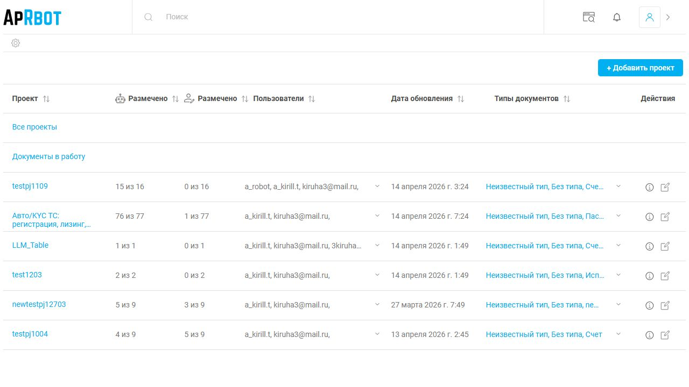

# Отчет о тестировании функционала doca.dreamdocs.ru

**Дата тестирования:** 17.04.2026  
**URL:** https://doca.dreamdocs.ru  
**Учетная запись:** kiruha3@mail.ru  
**Инструмент:** SkreenMaker (Playwright + автоматизированный walkthrough)

---

## 1. Общая информация

В ходе тестирования был выполнен автоматизированный обход всех интерактивных элементов на главной странице (дашборд) после авторизации. Для каждого элемента выполнялся клик, сохранялся скриншот результата, после чего производился возврат на главную страницу.

**Всего протестировано элементов:** 18  
**Все скриншоты сохранены в папке:** `output/walkthrough_v2/`

---

## 2. Структура дашборда (после входа)

На главной странице отображается таблица проектов со следующими колонками:
- **Проект** — название проекта
- **Размещено** — количество размещенных документов
- **Пользователи** — участники проекта
- **Дата обновления**
- **Типы документов**
- **Действия** — иконки информации и редактирования

Доступные проекты:
1. `testpj1109` — 15/16 документов
2. `Авто/КYC ТС: регистрация, лизинг, страхование` — 76/77 документов
3. `LLM_Table` — 1/1 документ
4. `test1203` — 2/2 документа
5. `newtestpj12703` — 5/9 документов
6. `testpj1004` — 4/9 документов

---

## 3. Результаты тестирования по элементам

### el01 — Логотип ApRobot (ссылка)
**Результат:** Переход на главную страницу дашборда  
**Статус:** ✅ Работает  
**Скриншот:** `after_click_el01_a.jpg`

---

### el02 — Поле поиска (input)
**Результат:** Поле получает фокус, страница не меняется  
**Статус:** ✅ Работает (ожидаемое поведение для input)  
**Скриншот:** `after_click_el02_input.jpg`

---

### el03 — Пустая ссылка (вероятно, иконка фильтра/настройки)
**Результат:** Страница не изменилась  
**Статус:** ⚠️ Нейтрально (возможно, технический элемент)  
**Скриншот:** `after_click_el03_a.jpg`

---

### el04 — "+ Добавить проект"
**Результат:** Переход на страницу "Нет доступа к проекту"  
**Статус:** ⚠️ Ограничение прав доступа  
**Скриншот:** `after_click_el04_a.jpg`

> **Примечание:** У текущего пользователя нет прав на создание новых проектов. Отображается сообщение: "У Вас нет доступа к проекту. Пожалуйста, запросите доступ у администратора."

---

### el05 — "Все проекты" (фильтр/ссылка)
**Результат:** Открывается страница загрузки документов "Загрузка документов..."  
**Статус:** ✅ Работает  
**Скриншот:** `after_click_el05_a.jpg`

---

### el06 — "Шаблоны и проекты" / переключатель рабочего пространства
**Результат:** Открывается рабочее пространство с загрузкой документов  
**Статус:** ✅ Работает  
**Скриншот:** `after_click_el06_a.jpg`

---

### el07 — Проект `testpj1109`
**Результат:** Открывается страница проекта со списком документов  
**Статус:** ✅ Работает  
**Скриншот:** `after_click_el07_a.jpg`

**Внутренний интерфейс проекта включает:**
- Левое меню: Файлы, Документы, Сравнение, Сплит, Загрузки, Справочники, Задачи
- Таблица документов с метриками: Авто..., Качество, Общий показатель
- Кнопка "+ Добавить документ"
- Панель инструментов: виды отображения, фильтры, чат, экспорт

---

### el08 — Пустая ссылка
**Результат:** Страница не изменилась  
**Статус:** ⚠️ Нейтрально  
**Скриншот:** `after_click_el08_a.jpg`

---

### el09 — Проект `Авто/КYC ТС: регистрация, лизинг, страхование`
**Результат:** Открывается страница проекта с большим количеством документов (76/77)  
**Статус:** ✅ Работает  
**Скриншот:** `after_click_el09_a.jpg`

**Наблюдения:**
- Проект содержит документы разных типов: PDF, свидетельства о регистрации, паспорта транспортных средств
- У каждого документа есть процент распознавания/качества
- Некоторые документы обработаны пользователем `kiruha3@mail.ru`, другие — `a_kirill.t`

---

### el10 — Пустая ссылка (настройки проекта Авто/КYC)
**Результат:** Открывается страница настроек проекта `Авто/КYC`  
**Статус:** ✅ Работает  
**Скриншот:** `after_click_el10_a.jpg`

**Доступные разделы настроек:**
- Основные настройки
- Пользователи
- Типы документов
- Конфигурация проекта
- ML классификатор

---

### el11 — Проект `LLM_Table`
**Результат:** Открывается страница проекта с 1 документом  
**Статус:** ✅ Работает  
**Скриншот:** `after_click_el11_a.jpg`

**Содержимое:**
- Документ: `3138136_Счет_доп_3138136.pdf.pdf_2.pdf`
- Дата создания: 9 февраля 2026 г.
- Редактор: a_kirill.t
- Метрики: 100% автоматическое распознавание, 70% качество, 89% общий показатель

---

### el12 — Пустая ссылка
**Результат:** Страница не изменилась  
**Статус:** ⚠️ Нейтрально  
**Скриншот:** `after_click_el12_a.jpg`

---

### el13 — Проект `test1203`
**Результат:** Открывается страница проекта с 2 документами  
**Статус:** ✅ Работает  
**Скриншот:** `after_click_el13_a.jpg`

**Содержимое:**
- `550_Исполнительный_лист_LLM_235_И...` — 82% качество
- `579_Исполнительный_лист_LLM_150_И...` — 62% качество

---

### el14 — Пустая ссылка
**Результат:** Страница не изменилась  
**Статус:** ⚠️ Нейтрально  
**Скриншот:** `after_click_el14_a.jpg`

---

### el15 — Проект `newtestpj12703`
**Результат:** Открывается страница проекта с 5 документами  
**Статус:** ✅ Работает  
**Скриншот:** `after_click_el15_a.jpg`

**Содержимое:**
- `dogovor_okazaniya_uslug.doc 1`
- `ufy123_5.xlsx.pdf 1`
- `document_1.docx`
- `options.json`
- `x_ui_4.db` (выделен голубым — возможно, выбран)
- `123.docx`
- `ufy123_5_Sheet.xlsx`
- `2904465_Счет_103150_счет.pdf.ef0c.pdf...`

---

### el16 — Пустая ссылка
**Результат:** Страница не изменилась  
**Статус:** ⚠️ Нейтрально  
**Скриншот:** `after_click_el16_a.jpg`

---

### el17 — Проект `testpj1004`
**Результат:** Открывается страница проекта с 4 документами  
**Статус:** ✅ Работает  
**Скриншот:** `after_click_el17_a.jpg`

**Содержимое:**
- `3138136_Счет_доп_3138136.pdf.pdf` — 24 страницы, 70% качество
- `Саммари_встречи_сойка_интеграции.d...`
- `Как_впервые_войти_в_VDI.pdf`
- `Документ_2026_04_04_095821.pdf`
- `Okta_Enrollment_Guide.pdf`
- `Трудоемкости_ГАЗель_2016_в_т.ч._Next...`

---

### el18 — Пустая ссылка
**Результат:** Страница не изменилась  
**Статус:** ⚠️ Нейтрально  
**Скриншот:** `after_click_el18_a.jpg`

---

## 4. Сводка по статусам

| Статус | Количество | Примечание |
|--------|-----------|------------|
| ✅ Работает | 11 | Проекты открываются, навигация функционирует |
| ⚠️ Нейтрально | 6 | Пустые ссылки/технические элементы без видимого эффекта |
| ⚠️ Ограничение доступа | 1 | "+ Добавить проект" требует расширенных прав |

---

## 5. Найденные особенности

1. **Чередование ссылок:** В таблице проектов между названиями проектов и пустыми ссылками (`el08`, `el10`, `el12`, `el14`, `el16`, `el18`). Вероятно, пустые ссылки — это иконки действий (информация, редактирование) или скрытые дропдауны.

2. **Доступ к созданию проектов:** Пользователь `kiruha3@mail.ru` не имеет прав на создание новых проектов — кнопка "+ Добавить проект" ведет на страницу с ошибкой доступа.

3. **Навигация внутри проекта:** Все открытые проекты имеют единообразный интерфейс с левым меню и таблицей документов. Функционал полностью работает.

4. **Качество документов:** В проекте `Авто/КYC` наблюдается разброс качества распознавания документов — от 43% до 100%.

---

## 6. Файлы скриншотов

Все скриншоты сохранены в текущей директории:
- `00_dashboard.jpg` — главная страница
- `after_click_el01_a.jpg` — el18_a.jpg — результаты кликов по каждому элементу
- `annotated_before_click_el01_a.jpg` — `annotated_before_click_el18_a.jpg` — скриншоты с разметкой элементов перед кликом
- `before_click_el01_a.jpg` — `before_click_el18_a.jpg` — скриншоты до клика
